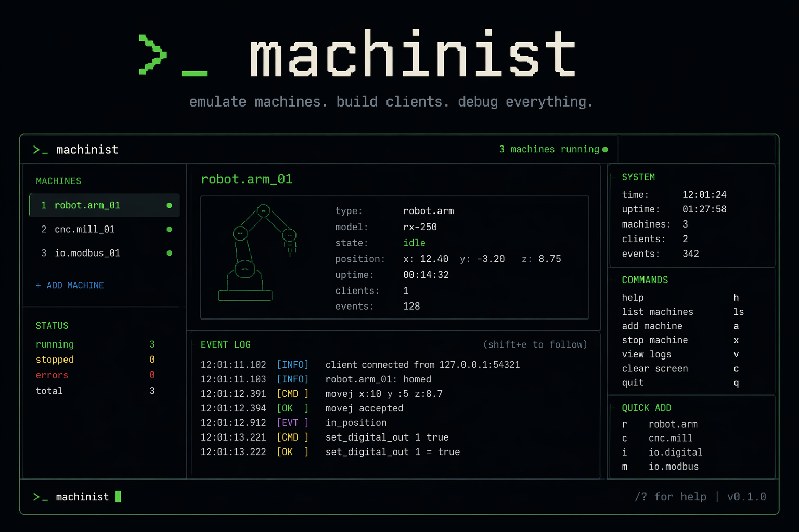

# ◇ Machinist



A composable, modern Python framework for **emulating fleets of
industrial machines** — robot arms, CNCs, grippers, IO controllers — so
your shop-floor software can be developed and tested without bringing
expensive iron to a stand-still.

```
+-------------------------------------------------------------+
|  ◇ Machinist  ─ a fleet of N device(s)                      |
+---------------+---------------------------------------------+
| devices table |     selected device detail                  |
+---------------+---------------------------------------------+
| event log (all devices) — scrolling                         |
+-------------------------------------------------------------+
| ◇ command bar (estop ur1 / set io1.o5 1 / …)                |
+-------------------------------------------------------------+
```

## Highlights

* **Pure-Python, single binary** (`uv run machinist`) — no Docker, no
  PLC simulators, no vendor SDKs required for the core flow.
* **Declarative YAML scenes** describing whole cells (robots, grippers,
  IO controllers, machines) including IO wiring between them.
* **Tiny native protocol stacks** — the framework's core speaks line
  protocols, Modbus/TCP and HTTP natively; S7 and SMB ship as thin
  shims over lazily-imported back-ends (`python-snap7`, `impacket`,
  `pysmb`, `smbprotocol`, `aiosmb`). No back-end is a hard dependency.
* **One worker thread per device, agnostic to threads vs. asyncio vs.
  simpy**. Each device decides its own concurrency model.
* **Pluggable kinematics** — `RobotModel(DHParams | urdf_path)` picks
  a back-end (`dh`, `pinocchio`, `pykdl`, `ik-geo`) lazily; same API
  as tupleo. Every robot arm accepts either an ``options.kinematics``
  block or top-level ``backend`` / ``dh_params`` / ``urdf`` keys.
* **Generic `robot` + SRCI** — point the generic robot at a URDF (or DH
  params), set `protocol: srci`, and pick any `transport` (TCP, UDP, …).
  A standalone `SrciClient` and `srci` CLI talk to it over the same
  transport abstraction, so SRCI is reusable outside the emulator.
* **OPC-UA** — robots and machines can publish live state
  (joints/pose/mode, or cycle/spindle/tool/parts/xyz) over OPC-UA via the
  optional `asyncua` back-end.
* **Live Textual TUI in a "Claude-code" style** — devices grid, signal
  panel, event log, program-file browser, and a modal command bar.
* **Bold neon web UI (stdlib-only)** — the same fleet, in the browser:
  live device grid, arm/CNC telemetry, an inputs/outputs signal grid, a
  streaming event log and a command bar. Pushes updates over Server-Sent
  Events (no websocket dependency) and renders with modern Chrome features
  (OKLCH, container queries, `:has()`, View Transitions). `--web`.
* **Composable, not extendable**: the abstract base classes
  (`Device`, `LineServerDevice`, `RobotArm`, `MachineState`) own the
  cross-cutting behaviour; per-vendor modules are 50–100 LoC each.

## Install / develop

```bash
uv sync             # install runtime + dev deps
uv run pytest -q    # run tests (sub-second)
uv run machinist kinds   # list registered device kinds
uv run srci --help       # drive a generic SRCI robot from the CLI
```

### Talking SRCI

The generic `robot` device speaks **SRCI** (command/status telegrams)
over a pluggable transport. Exercise one with the bundled CLI:

```bash
# in one shell: run a scene containing a `robot` device
uv run machinist run examples/scene.yaml --no-tui

# in another: drive it
uv run srci --host 127.0.0.1 --port 15001 enable
uv run srci --host 127.0.0.1 --port 15001 movej 0 -1.2 1.4 0 1.0 0
uv run srci --host 127.0.0.1 --port 15001 status
```

In Python, the client is transport-agnostic and reusable:

```python
from machinist.srci import SrciClient

with SrciClient.connect("127.0.0.1", 15001, transport="tcp") as c:
    c.enable()
    status = c.move_joint([0.0, -1.2, 1.4, 0.0, 1.0, 0.0])
    print(status.joints, status.pose)
```

Optional protocol back-ends:

```bash
uv pip install -e ".[modbus,s7,http,smb,kinematics,opcua]"
```

## Running a scene

```bash
uv run machinist run examples/scene.yaml
# or, for headless / CI:
uv run machinist run examples/scene.yaml --no-tui
```

### Web interface

Prefer a browser? Add `--web` to serve a live, bold "command deck" web UI
that mirrors the TUI — device grid, arm/CNC telemetry, an inputs/outputs
signal grid, a streaming event log and a command bar:

```bash
# web UI alongside the terminal TUI
uv run machinist run examples/scene.yaml --web

# headless operator dashboard (no TUI), web only
uv run machinist run examples/scene.yaml --no-tui --web \
    --web-host 0.0.0.0 --web-port 8080
```

Then open <http://127.0.0.1:8080>. The server is **pure standard library**:
state is a JSON snapshot (`GET /api/state`), commands POST to
`/api/command` (the same verbs as the TUI: `estop` / `reset` / `servo` /
`set` / `ls` / `run`), and live updates stream over **Server-Sent Events**
(`GET /api/events`) — so the web UI adds no runtime dependency. The frontend
is framework-free and leans on recent Chrome platform features (OKLCH colour,
container queries, `:has()`, the View Transitions API).

Override individual devices on the command line (handy for one-off
testing without editing YAML):

```bash
uv run machinist run examples/scene.yaml \
    -d ur_dashboard:ur_extra:127.0.0.5:30099
```

## YAML schema

```yaml
devices:
  - name: ur1                  # unique
    kind: ur_dashboard         # one of `machinist kinds`
    host: 127.0.0.1            # optional; defaults to 127.0.0.1
    port: 29999                # optional; defaults to the device's standard port
    options: {joint_count: 6}

io_links:
  - {source: io1.o5, target: gripper1.cmd_open}
```

When two devices want the same `host:port`, Machinist:

* **bumps the host along the loopback range** (`127.0.0.1` →
  `127.0.0.2`) if neither device pinned its host explicitly,
* **fails fast** if a host *was* pinned (silent reassignment is *worse*
  than a noisy error in industrial settings).

## Bundled devices

| Kind                | Protocol         | Default port | Notes                              |
| ------------------- | ---------------- | ------------ | ---------------------------------- |
| `ur_dashboard`      | TCP text         | 29999        | UR Dashboard (ur-rtde compatible)  |
| `motoman_nx100`     | TCP text (HSE)   | 80           | Yaskawa NX100/DX100 telnet         |
| `dobot_dashboard`   | TCP text         | 29999        | Dobot Verb(args); reply pattern    |
| `fanuc_r30ib`       | TCP text         | 18735        | fanucpy / FaRoC compatible verbs   |
| `robot`             | SRCI / TCP·UDP   | 15001        | Generic arm; URDF/DH + OPC-UA      |
| `haas_ngc`          | MDC+DPRINT+MTC+SMB | 5051       | Multi-service CNC; program library    |
| `mazak_840d`        | S7 (stub/snap7)  | 102          | Pluggable back-end, DB/byte/bit maps  |
| `mazak_smooth`      | IO + EIP + MTC   | 44818        | Mazak SmoothX / SmoothAI               |
| `pneumatic_gripper` | IO only          | n/a          | open/close + limit switches        |
| `onrobot_3fg25`     | Modbus/TCP       | 502          | Diameter, force, grip command      |
| `zimmer_ged6000il`  | IO-Link HTTP     | 80           | Emulates IFM AL1350 master         |
| `weidmuller_ur20`   | Modbus/TCP       | 502          | Configurable I/O width             |

## Mazak Smooth config notes

`mazak_smooth` models the Mazak robot interface as the **machine** side of
the cell (both SmoothX and SmoothAI variants). The emulator supports both
EtherNet/IP roles:

* **adapter** (default): listens on the device endpoint, typically TCP/44818
  plus UDP/2222, so an external scanner/client can connect inbound,
* **scanner**: opens an outbound Class 1 I/O connection to the robot
  **Adapter/Slave** named in `options.ethernetip.host`,
* `interfaces: [io]` keeps the scene local and signal-driven,
* `interfaces: [ethernetip]` enables only the 100-byte EtherNet/IP blocks,
* `interfaces: [io, ethernetip]` runs the native signal bank and EtherNet/IP
  together.

```yaml
devices:
  - name: smooth
    kind: mazak_smooth
    options:
      interfaces: [io, ethernetip]
      # Default adapter mode: accept inbound EtherNet/IP sessions.
      ethernetip:
        mode: adapter
        udp_port: 2222
      mtconnect_port: 5053
```

Use scanner mode when you want Machinist to initiate the connection instead:

```yaml
devices:
  - name: smooth
    kind: mazak_smooth
    options:
      interfaces: [ethernetip]
      ethernetip:
        mode: scanner
        host: 192.168.90.20        # remote robot adapter address
        port: 44818
        originator_udp_port: 2222
        target_udp_port: 2222
        output_assembly_instance_id: 100
        input_assembly_instance_id: 101
        requested_packet_rate_ms: 20
```

With `io` enabled, the emulator exposes named signals like `di107`, `di108`,
`di109`, `do102`, `do103`, `do107`, and `do108` while still maintaining the
full 100-byte Mazak input/output blocks internally.

The TUI and web UI both decode those 100-byte blocks into named Mazak fields,
showing raw packet hex, bit/word/string registers, and derived values such as
the active program and current alarm.

## Architecture (one screenful)

```
machinist/
├── core/              ← framework spine, no vendor knowledge
│   ├── device.py            ← Device ABC, lifecycle, ready signal
│   ├── line_device.py       ← LineServerDevice convenience base
│   ├── events.py            ← thread-safe pub/sub
│   ├── io.py                ← Signal / SignalBank / IOMap
│   ├── addressing.py        ← AddressAllocator (loopback bump)
│   ├── registry.py          ← @register decorator, default_registry
│   ├── config.py            ← pydantic SystemConfig + YAML loader
│   └── world.py             ← WorldBuilder, World context manager
├── transport/
│   ├── line_server.py        ← reusable threaded line protocol server
│   ├── framing.py            ← Framer Protocol (newline/CRLF/paren)
│   ├── modbus_server.py      ← native MBAP/TCP slave (FC 03/06/16)
│   ├── s7_server.py          ← S7Store + pluggable back-ends
│   ├── broadcast.py          ← one-to-many line TCP (DPRINT)
│   ├── message.py            ← MessageTransport/Server (TCP+UDP framing)
│   ├── mtconnect.py          ← /probe + /current XML (incl. spindle/tool)
│   ├── opcua_server.py       ← lazy asyncua server from node readers
│   ├── smb_share.py          ← SmbShare Protocol + lazy back-ends
│   └── iolink_http_master.py ← stdlib HTTP gateway emulating AL1350
├── kinematics/
│   ├── api.py                ← Kinematics Protocol + RobotModel + registry
│   ├── dh_backend.py         ← pure-numpy DH FK + damped-LS IK
│   ├── pinocchio_backend.py  ← lazy pinocchio wrapper
│   ├── pykdl_backend.py      ← lazy PyKDL wrapper
│   └── ikgeo_backend.py      ← lazy ik-geo wrapper
├── devices/
│   ├── robots/        ← UR, Motoman, Dobot, Fanuc, generic — share arm.py
│   ├── machines/      ← HAAS, Mazak — all share state.py + gcode.py
│   ├── grippers/      ← OnRobot, Zimmer, Pneumatic
│   └── io_controllers/← Weidmuller UR20
├── srci/             ← transport-agnostic SRCI codec/client/server + CLI
├── tui/app.py         ← Textual UI, command bar, live signal panel
├── web/               ← stdlib web UI: api.py (pure) + server.py (SSE) + static/
└── cli.py             ← Typer CLI (run, kinds, version)
```

## Adding a new device kind

1. Subclass `Device`, `LineServerDevice`, or wrap an existing transport.
2. If your device has IO, expose `self.io: SignalBank` in `__init__`.
3. Decorate the factory with `@register("my_kind", default_port=12345)`.
4. Import the module from `devices/<category>/__init__.py`.

That's it — `WorldBuilder` will instantiate, allocate an endpoint,
adopt the IO bank, and the TUI will show it.

## Roadmap

* 3D web visualiser — the browser UI already streams live state over
  Server-Sent Events, so layering a WebGL scene on top of the existing
  `/api/state` + `/api/events` feed is purely additive.
* Grow the g-code interpreter beyond the emulation subset (G2/G3,
  canned cycles, tool tables).
* Expand the MTConnect agent to the full Streams schema with history.

## License

MIT.
