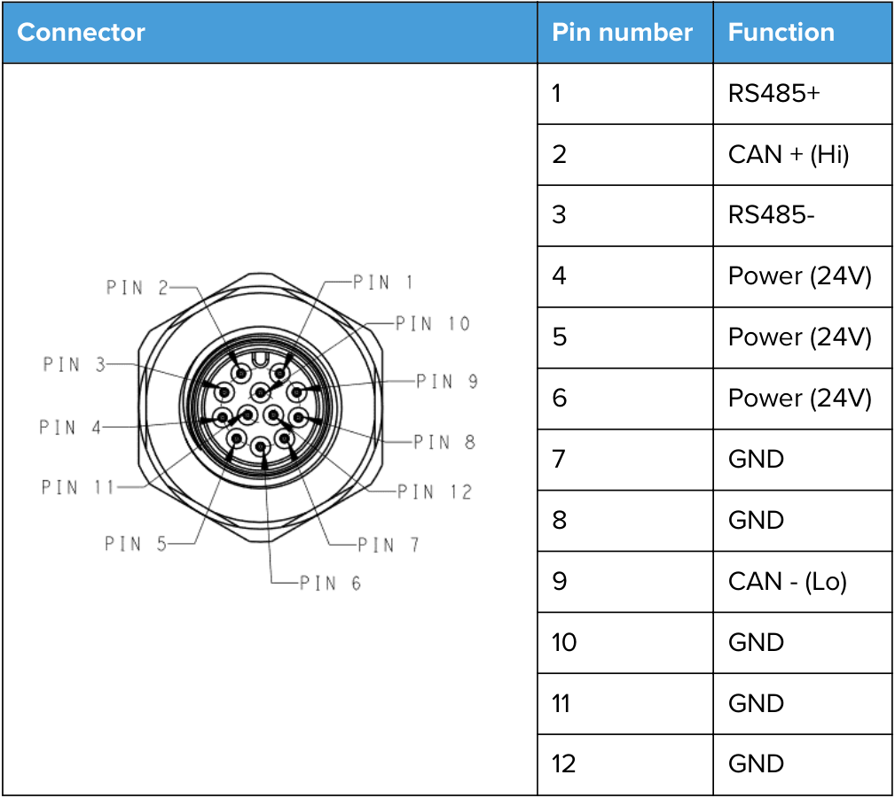
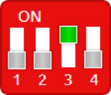
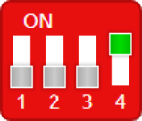
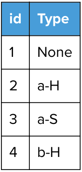

# **<mark>Contents</mark>** 

1. [Introduction](Intro)
2. [Connectors and Pinouts](Conn)
3. [Communication Protocols](Comms)
    1. [Modbus RTU and TCP](Modbus)
        1. [Settings](Settings)
        2. [Ethernet Interface Setup](Setup)
        3. [Function Codes](Codes)
        4. [Common Registers](Registers)
        5. [Device Specific Registers](Devices)
            1. 2FG7/2FG14
            2. 2FGP20
            3. 3FG15/3FG25
            4. Eyes
            5. HEX-E/H QC
            6. Lift100
            7. MG10
            8. RG2/6
            9. RG2-FT
            10. Sander
            11. Screwdriver
            12. SG
            13. VG10/VGC10
            14. VGP20
            15. VGP30
            16. Compute Box / Eye Box
            17. Compute Box I/O

# 1 Intro

# 2 Connectors And Pinouts 

The tools are connected through the OnRobot Quick Changer interface. 

There are 3 different Quick Changer types, that are known as mounting options: 

- Quick Changer 

- Dual Quick Changer 

- HEX-E/H QC 

These mounting options have connectors that could be used for interfacing the tools to the robots. 

The Quick Changer and Dual Quick Changer have an M8-8 pin FEMALE connector: 

|**Connector** **Pin** **number**|**Function**|
|---|---|
|1|RS485+|
|2|RS485-|
|3|GND|
|4|Power (24V)|
|5|Power (24V)|
|6|GND|
|7|Power (24V)|
|8|GND|

The HEX-E/H QC has an M12-12pin MALE connector: 

<!-- Start of picture text -->
Connector Pin number Function 1 RS485+ 2 CAN + (Hi) 3 RS485- 4 Power (24V) 5 Power (24V) 6 Power (24V) 7 GND 8 GND 9 CAN - (Lo) 10 GND 11 GND 12 GND <!-- End of picture text -->

# 3. Communication Protocols

## 3.1. Modbus RTU and TCP

MODBUS RTU uses RS485 as the physical layer. For further details on the protocol, please refer to modbus.org’s MODBUS over Serial Line Specification and Implementation Guide ( **http://www.modbus.org/docs/Modbus_over_serial_line_V1_02.pdf** ) and MODBUS Application Protocol Specification ( **http://www.modbus.org/docs/ Modbus_Application_Protocol_V1_1b.pdf** ). 

The following OnRobot products support MODBUS RTU: 

- 2FG7 

- 2FG14 

- 2FGP20 

- 3FG15 

- 3FG25 

- Lift100 

- MG10 

- RG2 

- RG6 

- SG 

- VG10 

- VGC10 

- VGP20 

MODBUS TCP uses Ethernet as the physical layer, otherwise it is very similar to Modbus RTU. MODBUS TCP can be only used with a Compute Box / Eye Box. For further details on the protocol, please refer to modbus.org’s MODBUS Application Protocol Specification ( **http:// www.modbus.org/docs/Modbus_Application_Protocol_V1_1b3.pdf** ). 

The following OnRobot products only support MODBUS TCP: 

- Compute Box / Eye box 

- Eyes 

- HEX-E/H QC 

- RG2-FT 

- Screwdriver 

###### **NOTE:** 

In this section the address and register values are written in the following format: 

DD (HH) where the DD is in decimal and the HH is in hexadecimal format. 

### 3.1.1. Settings

The following table below shows the required settings to be used when communicating with the OnRobot products over MODBUS RTU. 

|**Settings**||
|---|---|
|Baud rate [bit/sec]|1 000 000|
|Start bits|1|
|Data bits|8|
|Parity|Even|
|Stop bits|1|
|CRC Check|16 bit (MODBUS default)|
|CRC Polynomial|0xA001 (MODBUS default)|

The following table below shows the required settings to be used when communicating with the OnRobot products over MODBUS TCP. See **3.1.2. Ethernet Interface Setup** on how to set up the Ethernet interface for the Compute Box / Eye Box. 

|**Settings**||
|---|---|
|Modbus TCP server IP address|Compute Box / Eye Box IP address (default is 192.168.1.1)|
|Port number|502|
|Number of concurrent connections|1|

For the tools and devices not specified in the below tables, the Device address depends only on the mounting option and not on the tool type: 

||**via Quick Changer**|**via HEX-E/H QC**|**via Dual Quick Changer**|
|---|---|---|---|
|Device address|65 (0x41)|65 (0x41)|Primary side (1) - 66 (0x42) Secondary side (2) - 67 (0x43)|

For LIFT100, the device address is fixed: 

||**LIFT100**|
|---|---|
|Device address|165 (0xA5)|

For HEX-E/H QC and RG2-FT, the Device address is fixed (it only works when communicating over MODBUS TCP and when connecting to the Compute Box): 

||**HEX-E/H QC**|**RG2-FT**|
|---|---|---|
|Device address|64 (0x40)|65 (0x41)|

For the Compute Box / Eye Box, the Device address is fixed (it has only one functionality to reset the tool power): 

||**Compute Box / Eye Box**|
|---|---|
|Device address|63 (0x3F)|

For the Eyes, the Device address is fixed: 

||**Eyes**|
|---|---|
|Device address|62 (0x3E)|

### 3.1.2. Ethernet Interface Setup

A proper IP address must be set for the Compute Box/Eye Box and the robot/computer to be able to use the Ethernet interface. The IP address can be configured using DIP switches 3 and 4. 

###### **WARNING:** 

Stop the robot program before you change any Ethernet interface settings. 

###### **NOTE:** 

Configuring DIP switch 3 will remove any previously set static IP address. 

To change between modes, first change the DIP switches and then cycle the Compute Box/Eye Box power so the changes will take effect. 

**DIP 3** - sets the Compute Box / Eye Box IP address 

- **ON** : Fixed IP (192.168.1.1) 

- 

**OFF** : Dynamic or Static IP _(can be configured via the Web Client)_ 

**DIP 4** - sets whether the connected robot or laptop will receive IP address from the Compute Box / Eye Box 

- **ON** : DHCP server is disabled 

- **OFF** :DHCP server is enabled 

We recommend to set the DIP switches according to either of the two options below: 

- **Fix IP/Auto mode** - in simple installations (no external network and/or no PLC connected) 

- **Advanced mode** - in more complex installations (external network and/or PLC are used) 

###### **Fix IP/Auto mode (factory default)** 

Set the DIP switch 3 to ON and the DIP switch 4 to OFF position and cycle the power so the changes will take effect. 

|**IP Address of the Compute Box/Eye** **Box**|**IP Address of the Robot/Computer**|
|---|---|
|The IP address of the Compute i|The Compute Box/Eye Box will automatically assign an|
|Box/Eye Box is fixed 192.168.1.1. This IP address cannot be changed.|IP address to the connected robot/computer if it was configured to obtain an IP address automatically.|

|**NOTE:**|
|---|
|The assigned IP address range is|
|192.168.1.100-105 (with subnet mask|
|255.255.255.0).|
|If the Compute Box/Eye Box is used in a|
|company network where a DHCP server|
|is already in use, it is recommended to|
|use Advanced mode.|

In this mode, the DHCP server of the Compute Box/Eye Box is enabled. 

###### **Advanced mode (any static or dynamic IP/subnet mask)** 

Set the DIP switch 3 to OFF and the DIP switch 4 to ON position and cycle the power so the changes will take effect. 

|**IP Address of the Compute Box/Eye** **box**|**IP Address of the Robot/Computer**|
|---|---|
|**Case 1**: Static IP address The IP address 192.168.1.1 is already in use in your network or a different subnet needs to be configured.|The Compute Box/Eye Box will not assign an IP address to the robot/computer. Set the IP address of the robot/computer manually. Make sure to have a matching IP setting to your robot/ computer network for a proper communication. Use the same subnet but different IP address.|
|**Case 2**: Dynamic IP address *|The IP address of the robot/computer is set dynamically. An external DHCP server assigns the IP address to the robot/computer.|

* By default, the IP address of the Compute Box/Eye Box is set to Dynamic IP. 

The IP address of the Compute Box/Eye Box can be set to any value by using the Web Client. For more details, see section Web Client: Configuration Menu. Under **Network settings** , set the **Network mode** to either **Static IP** or **Dynamic IP** . 

In this mode, the DHCP server of the Compute Box/Eye Box is disabled. 

### 3.1.3. Function Codes

OnRobot products currently support the function codes listed below. The products will respond with an appropriate exception code, if the function is not executed correctly. Please refer to MODBUS Application Protocol page 48 for detailed description of the different exception codes. Note that the product will provide no response if the settings are not correct. 

###### **3 (0x03) Read Holding Registers** 

Use this function code to read out one or multiple consecutive registers. Please refer to MODBUS Application Protocol page 15 for frame and response details. 

###### **6 (0x06) Write Single Register** 

Use this function code to set the value of a single register. Please refer to MODBUS Application Protocol page 19 for frame and response details. 

###### **16 (0x10) Write Multiple Registers** 

Use this function code to set the values of multiple consecutive registers. Please refer to MODBUS Application Protocol page 19 for frame and response details. 

###### **23 (0x17) Read/Write Multiple Registers** 

Use this function code to set the values and read out one or multiple consecutive registers. Note that the registers to be set are set before the registers to be read are read. Please refer to MODBUS Application Protocol page 38 for frame and response details. 

##### **3.1.4. Common Registers** 

Common registers are implemented by all OnRobot devices and they are always at the same position. 

|**Addre**|**ss**|**Device**|**Product code**|
|---|---|---|---|
|||VG10|0x10|
|||VGC10|0x11|
|||VGP20|0x18|
|||RG2|0x20|
|||RG6|0x21|
|||RG2-FT|0x22|
|||SG|0x50|
|||3FG15|0x70|
|1536|0x600|3FG25|0x71|
|||Screwdriver|0x80|
|||Lift100 v1|0x100|
|||Lift100 v2|0x101|
|||MG10|0xA0|
|||Sander|0xB0|
|||2FG7|0xC0|
|||2FG14|0xC1|
|||2FGP20|0xF0|

This register can be used to easily identify the currently connected device on the Quick Changer. 

The firmware version running on the devices is stored in registers 0x604 and 0x605 in the following format: 

|**Addre**|**ss**|**Firmware version major and minor of the device**|
|---|---|---|
|1540|0x604|Upper 8 bit is the major, lower 8 bit is the minor version|
|1541|0x605|Build number of the firmware version stored as a 16 bit number|

###### **Serial number** 

The 32 byte long serial number of the connected device can be read from registers 0x609-0x618. 

Every register in this range contains two ASCII characters in the following format: 

|**Addre**|**ss**|**ASCII character**|
|---|---|---|
|1545|0x609|ASCII char index 0 and ASCII char index 1 of the serial|
|1560|0x618|ASCII char index 30 and ASCII char index 31 of the serial|

### 3.1.5. Device Specific Registers

#### 3.1.5.1. 2FG7/2FG14

The table below provides an overview of the available MODBUS registers in the 2FG7/2FG14. 

All writable registers can be accessed using function codes 6, 16 or 23 and all readable registers can be accessed using function codes 3 or 23. 

|**Addre**|**ss**|**Register**|**Access**|
|---|---|---|---|
|0|0x0000|Target width|Write|
|1|0x0001|Target force|Write|
|2|0x0002|Target speed|Write|
|3|0x0003|Command|Write|
|256|0x0100|Status|Read only|
|257|0x0101|External width|Read only|
|258|0x0102|Internal width|Read only|
|259|0x0103|Min external width|Read only|
|260|0x0104|Max external width|Read only|
|261|0x0105|Min internal width|Read only|
|262|0x0106|Max internal width|Read only|
|263|0x0107|Force|Read only|
|1024|0x0400|Finger length|Read/Write|
|1025|0x0401|Finger height|Read/Write|
|1026|0x0402|Finger orientation|Read/Write|
|1027|0x0403|Fingertip offset|Read/Write|
|1029|0x0405|Max force|Read only|

###### **0 (0x0000) Target width (Write)** 

This register sets the target width of the gripper in 1/10 mm. 

When the workpiece is gripped externally, the target with is measured between the inside of the fingers. 

When the workpiece is gripped internally, the target with is measured between the outside of the fingers. 

###### **1 (0x0001) Target force (Write)** 

This register sets the target force to be reached when gripping and holding a workpiece in N. 

###### **2 (0x0002) Target speed (Write)** 

This register sets the target speed of the gripper closure as a percentage value between 10-100%. 

###### **3 (0x0003) Command (Write)** 

This register sets the selected command. 

|**Command (Enum)**|**Description**|
|---|---|
|1|Do grip external|
|2|Do grip internal|
|3|Stop|

###### **256 (0x0100) Status (Read only)** 

This register indicates the status of the gripper. 

|**Cod**|**e**||**Description**|
|---|---|---|---|
|bit|hex|dec||
|0|0x0001|1|Busy|
|1|0x0002|2|Grip detected|
|3|0x0008|8|Error: Not calibrated|
|4|0x0010|16|Error: Linear sensor|

###### **257 (0x0101) External width (Read only)** 

This register indicates the external width of the gripper fingers in 1/10 mm signed. 

###### **258 (0x0102) Internal width (Read only)** 

This register indicates the internal width of the gripper fingers in 1/10 mm signed. 

###### **259 (0x0103) Min external width (Read only)** 

This register indicates the minimum external width of the gripper fingers in 1/10 mm. 

###### **260 (0x0104) Max external width (Read only)** 

This register indicates the maximum external width of the gripper fingers in 1/10 mm. 

###### **261 (0x0105) Min internal width (Read only)** 

This register indicates the minimum internal width of the gripper fingers in 1/10 mm. 

###### **262 (0x0106) Max internal width (Read only)** 

This register indicates the maximum internal width of the gripper fingers in 1/10 mm. 

###### **263 (0x0107) Force (Read only)** 

This register indicates the gripper finger force in N. 

###### **1024 (0x0400) Finger length (Read/Write)** 

This register sets the gripper finger length value in 1/10 mm. 

###### **1025 (0x0401) Finger height (Read/Write)** 

This register sets the gripper finger height value in 1/10 mm. 

###### **1026 (0x0402) Finger orientation (Read/Write)** 

This register sets the gripper finger orientation to face 0 inward or 1 outward. 

**1027 (0x0403) Fingertip offset (Read/Write)** 

This register sets the gripper fingertip offset in 1/100 mm. 

###### **1029 (0x0405) Maximum force (Read only)** 

This register indicates the maximum force of the gripper in N. 

#### **3.1.5.2. 2FGP20** 

The table below provides an overview of the available MODBUS registers in the 2FGP20. 

All writable registers can be accessed using function codes 6, 16 or 23 and all readable registers can be accessed using function codes 3 or 23. 

|**Address**|**Register**|**Access**|
|---|---|---|
|1 0x0001|VG commands|Write|

|**Addre**|**ss**|**Register**|**Access**|
|---|---|---|---|
|2|0x0002|FG Width|Write|
|3|0x0003|FG Force|Write|
|4|0x0004|FG Speed|Write|
|5|0x0005|FG Commands|Write|
|256|0x0100|Status|Read only|
|258|0x0102|Max force|Read only|
|259|0x0103|External width|Read only|
|261|0x0105|Min external width|Read only|
|262|0x0106|Max external width|Read only|
|265|0x0109|Force|Read only|
|266|0x010A|VG vacuum percent|Read only|
|1024|0x0400|Moving finger length|Read/Write|
|1025|0x0401|Moving finger height|Read/Write|
|1026|0x0402|Moving fingertip offset|Read/Write|
|1027|0x0403|Fixed finger length|Read/Write|
|1028|0x0404|Fixed finger height|Read only|
|1029|0x0405|Fixed fingertip offset|Read only|
|1031|0x0407|Vacuum cups offset|Read only|

###### **1 (0x0001) VG commands (Write)** 

This register sets the vacuum grip command. 

|**Bit**|**Name**|**Description**|
|---|---|---|
|0–7|Grip vacuum in %|The target vacuum that the channels will try to achieve.|
|15|Ignore|When set to high (1), the command is ignored for the channel.|

###### **2 (0x0002) FG Width (Write)** 

This register indicates the width of the gripper fingers in 1/10 mm signed. 

###### **3 (0x0003) FG Force (Write)** 

This register indicates the gripper finger force in 1/10 N. 

###### **4 (0x0004) FG Speed (Write)** 

This register indicates the gripping speed in 1/10 %. 

###### **5 (0x0005) FG Commands (Write)** 

This register sets the selected command. 

|**FG Commands (Enum)**|**Description**|
|---|---|
|0|No commands|
|1|FG do grip external|
|3|FG stop|

###### **256 (0x0100) Status (Read only)** 

This register indicates the status of the gripper. 

|**Bits 5-4**|**Bits 3-2**|
|---|---|
|vg_release_status|vg_grip_status|

|**vg_grip_status (Enum)**|**Description**|
|---|---|
|0|Not gripped|
|1|Grip detected|
|2|Grip timeout|
|3|Grip lost|
|**vg_release_status** **(Enum)**|**Description**|
|0|Not released|
|1|Release ok|
|2|Release fail|

|**Cod**|**e**||**Description**|
|---|---|---|---|
|bit|hex|dec||
|0|0x0100|1|Busy (both the finger and the vacuum gripper)|
|1|0x0100|2|FG grip detected|
|6|0x0100|64|Error: Motor not calibrated|
|7|0x0100|128|Error: Solenoid not calibrated|
|8|0x0100|256|Error: Encoders not calibrated|

###### **259 (0x0103) External width (Read only)** 

This register indicates the external width of the gripper fingers in 1/10 mm. 

###### **261 (0x0105) Min external width (Read only)** 

This register indicates the minimum external width of the gripper fingers in 1/10 mm. 

###### **262 (0x0106) Max external width (Read only)** 

This register indicates the maximum external width of the gripper fingers in 1/10 mm. 

###### **265 (0x0109) Force (Read only)** 

This register indicates the gripper finger force in 1/10 N. 

###### **266 (0x010A) VG vacuum percent (Read only)** 

This register indicates the vacuum percentage in 1/10 %. 

**1024 (0x0400) Moving finger length (Read/Write)** 

This register sets the moving gripper finger length value in 1/10 mm. 

**1025 (0x0401) Moving finger height (Read/Write)** 

This register sets the moving gripper finger height value in 1/10 mm. 

**1026 (0x0402) Moving fingertip offset (Read/Write)** 

This register sets the moving gripper fingertip offset in 1/100 mm. 

**1027 (0x0403) Fixed finger length (Read/Write)** 

This register sets the fixed gripper finger length value in 1/10 mm. 

**1028 (0x0404) Fixed finger height (Read/Write)** 

This register sets the fixed gripper finger height value in 1/10 mm. 

**1029 (0x0405) Fixed fingertip offset (Read/Write)** 

This register sets the fixed gripper fingertip offset in 1/100 mm. 

**1031 (0x0407) Vacuum cups offset (Read/Write)** 

This register sets the vacuum cups offset in 1/100 mm. 

#### **3.1.5.3. 3FG15/3FG25** 

The table below provides an overview of the available MODBUS registers in the 3FG. 

All writable registers can be accessed using function codes 6, 16 or 23 and all readable registers can be accessed using function codes 3 or 23. 

|**Addre**|**ss**|**Register**|**Access**|
|---|---|---|---|
|0|0x0000|Target force|Write|
|1|0x0001|Target diameter|Write|
|2|0x0002|Grip type|Write|
|3|0x0003|Control|Write|
|256|0x0100|Status|Read only|
|257|0x0101|Raw diameter|Read only|
|258|0x0102|Diameter with fingertip offset|Read only|
|259|0x0103|Force applied|Read only|
|270|0x010E|Finger length|Read only|
|272|0x0110|Finger position|Read only|
|273|0x0111|Fingertip offset|Read only|
|513|0x0201|Minimum diameter|Read only|
|514|0x0202|Maximum diameter|Read only|
|1025|0x0401|Set finger length|Read/Write|
|1027|0x0403|Set finger position|Read/Write|
|1028|0x0404|Set fingertip offset|Read/Write|

###### **0 (0x0000) Target force (Write)** 

This field sets the target force to be reached when gripping and holding a workpiece. It must be provided in 10*%. The valid range is 0 to 1000. 

###### **1 (0x0001) Target diameter (Write)** 

This field sets the target diameter to achieve. It must be provided in 1/10th millimeters. The valid range depends on the finger position, finger length and fingertip diameter. For more information see the Technical sheet section. 

###### **2 (0x0002) Grip type (Write)** 

This field sets whether the grip will be external 0 or internal 1. It also sets the if the diameter is measured from the inside of the fingertips (external grip) or from the outside of the fingertips (internal grip). 

###### **3 (0x0003) Control (Write)** 

The control field is used to start and stop gripper motion. Only one option should be set at a time. Please note that the gripper will not start a new motion before the one currently being executed is done (see busy flag in the Status field). The valid commands are: 

|**Value**|**Name**|**Description**|
|---|---|---|
|1 (0x0001)|grip|Start the motion, with the preset target force and diameter. Please note that the gripper will ignore this command if the busy flag is set in the status field.|
|2 (0x0002)|move|Start the motion without applying the target force|
|4 (0x0004)|stop|Stop the current motion.|
|5 (0x0005)|flexible grip|The fingers will move from the current diameter towards the target diameter, and do a grip with the desired force. Maximum force is 140 N when 100% is selected, and payload is maximum 8 kg.|

###### **256 (0x0100) Status (Read only)** 

This status field indicates the status of the gripper and its motion. It is composed of 7 flags, described in the table below. 

|**Bit**|**Name**|**Description**|
|---|---|---|
|0 (LSB)|busy|High (1) when a motion is ongoing, low (0) when not. The gripper will only accept new commands when this flag is low.|
|1|grip detected|High (1) when an internal- or external grip is detected.|
|2|Force grip detected|High (1) when an internal- or external grip with the target force is detected.|
|3|calibration|Whether calibration is OK or not.|
|4-16|Reserved|Not used|

###### **257 (0x0101) Raw diameter (Read only)** 

Indicates the current diameter measured from the center of the fingertips. 

**258 (0x0102) Diameter with fingertip offset (Read only)** 

Indicates the current diameter considering the fingertip offset in 1/10 millimeters. Please note that the value is a signed two’s complement number. 

###### **259 (0x0103) Force applied (Read only)** 

Indicates the force applied in 1/10 %. 

**270 (0x010E) Finger length (Read only)** 

Indicates the length of the finger in 1/10 mm 

###### **272 (0x0110) Finger position (Read only)** 

Indicates how the finger is mounted. Positions available are 1, 2 and 3. 

**273 (0x0111) Fingertip offset (Read only)** 

This field sets the Fingertip offset in 1/100 mm. 

**275 (0x0113) Actual width with offset (Read only)** 

Indicates the current width between the gripper fingers in 1/10 millimeters. The set fingertip offset is considered. 

###### **513 (0x0201) Minimum diameter (Read only)** 

Indicates the minimum reachable diameter depending on the finger position, finger length and fingertip diameter. For more information see the **Technical sheet** section. 

###### **514 (0x0202) Maximum diameter (Read only)** 

Indicates the maximum reachable diameter depending on the finger position, finger length and fingertip diameter. For more information see the **Technical sheet** section. 

###### **1025 (0x0401) Set Finger length (Read/Write)** 

This field sets the finger length in 1/10 mm. 

**1027 (0x0403) Set Finger position (Read/Write)** 

This field sets the finger position 1, 2 or 3. 

**1028 (0x0404) Set Fingertip offset (Read/Write)** 

This field sets the fingertip offset diameter in 1/100 mm. 

#### **3.1.5.4. Eyes** 

The table below provides an overview of the available MODBUS registers in the Eyes. 

###### **NOTE:** 

The Eyes only works on MODBUS TCP. 

All writable registers can be accessed using function codes 6, 16 or 23 and all readable registers can be accessed using function codes 3 or 23. 

|**Addr**|**ess**|**Register**|**Access**|
|---|---|---|---|
|0|0x0000|Robot Position x|Write|
|1|0x0001|Robot Position y|Write|
|2|0x0002|Robot Position z|Write|
|3|0x0003|Robot Orientation 1|Write|
|4|0x0004|Robot Orientation 2|Write|
|5|0x0005|Robot Orientation 3|Write|
|6|0x0006|Robot Orientation 4|Write|
|7|0x0007|Program ID to Execute|Write|
|8|0x0008|Gripper Selection|Write|
|9|0x0009|Robot Type|Write|
|10|0x000A|Workpiece Type|Write|
|100|0x0064|Command|Write|
|256|0x0100|Status Register|Read only|
|257|0x0101|Object Count|Read only|
|258|0x0102|Workpiece Type|Read only|
|259|0x0103|Inspection Evaluation|Read only|
|260|0x0104|Inspection Match Percentage|Read only|
|272|0x0110|Object Position x|Read only|
|273|0x0111|Object Position y|Read only|
|274|0x0112|Object Position z|Read only|
|275|0x0113|Object Orientation 1|Read only|

|**Addr**|**ess**|**Register**|**Access**|
|---|---|---|---|
|276|0x0114|Object Orientation 2|Read only|
|277|0x0115|Object Orientation 3|Read only|
|278|0x0116|Object Orientation 4|Read only|

###### **0 (0x0000) Robot Position x (Write)** 

###### **1 (0x0001) Robot Position y (Write)** 

###### **2 (0x0002) Robot Position z (Write)** 

These registers set the Tool Center Point position coordinate on the x, y and z axes respectively. They must be provided in 1/10 millimeters. 

###### **3 (0x0003) Robot Position Orientation 1 (Write)** 

###### **4 (0x0004) Robot Position Orientation 2 (Write)** 

###### **5 (0x0005) Robot Position Orientation 3 (Write)** 

###### **6 (0x0006) Robot Position Orientation 4 (Write)** 

These registers set the orientation of the Tool Center Point in 1/100 degree/rad. Depending on the robot type the value of the orientation is either measured in Euler angles or quaternions. They must be provided as 1/100 value. The (0x0006) Robot Orientation 4 register is optional and is only needed if the value of the orientation is measured in quaternions. 

###### **7 (0x0007) Program ID to Execute (Write)** 

This register sets the program ID to execute. 

###### **8 (0x0008) Gripper Selection (Write)** 

This register sets the gripper to be selected. 

|**Value**|**Description**|
|---|---|
|0|Ignore|
|1|Single/Primary|
|2|Secondary|

###### **9 (0x0009) Robot Type (Write)** 

This register sets the manufacturer of the robot. 

|**Value**|**Description**|
|---|---|
|0|Ignore|
|1|UR|
|2|KUKA|
|3|Yaskawa|
|4|Kawasaki|
|5|Nachi|
|6|Techman|
|7|Fanuc|
|8|Doosan|
|9|Hanwha|
|10|ABB|
|11|Kassow|
|12|Denso|
|13|Omron TM|
|14|Epson|
|255|Other|

###### **10 (0x000A) Workpiece Type (Write)** 

This register sets the workpiece type. 

###### **100 (0x0064) Command (Write)** 

This register sets the selected command. 

|**Value**|**Description**|
|---|---|
|1|Command Run Program|
|2|Command Calibrate|
|3|Command Get Workpiece Pose|
|4|Command Set Robot Pose for Camera View|

|**Value**|**Description**|
|---|---|
|5|Command Get Robot Pose for Camera View|

###### **256 (0x0100) Status register (Read only)** 

This register indicates the status of the Eyes. 

|**Value**|**Description**|
|---|---|
|0-1|Run counter|
|2|Error|
|3-10|Object count|
|11-15|Unused|

###### **257 (0x0101) Object Count (Read only)** 

This register indicates the number of the detected workpieces as an unsigned byte. 

###### **258 (0x0102) Workpiece type (Read only)** 

This register indicates the workpiece type of the detected object as an unsigned byte. 

###### **259 (0x0103) Inspection Evaluation (Read only)** 

This register returns the result of an inspection. 

|**Value**|**Description**|
|---|---|
|0|Invalid|
|1|Pass|
|2|Fail|

###### **260 (0x0104) Inspection Match Percentage (Read only)** 

This register returns the inspection match in percentage. 

###### **272 (0x0110) Object Position x (Read only)** 

**273 (0x0111) Object Position y (Read only)** 

**274 (0x0112) Object Position z (Read only)** 

These registers return the workpiece position coordinate on the x, y and z axes respectively in 1/10 millimeters. 

###### **275 (0x0113) Object Orientation 1 (Read only)** 

**276 (0x0114) Object Orientation 2 (Read only)** 

**277 (0x0115) Object Orientation 3 (Read only)** 

###### **278 (0x0116) Object Orientation 4 (Read only)** 

These registers return the orientation of the workpiece as 1/100 degree/rad value. Depending on the robot type the value of the orientation is either measured in Euler angles or quaternions. The (0x0116) Object Orientation 4 register is optional and is dependent on the robot type. It is only available if the value of the orientation is measured in quaternions. 

#### **3.1.5.5. HEX-E/H QC** 

The table below provides an overview of the available MODBUS registers in the HEX-E/H QC. 

All writable registers can be accessed using function codes 6, 16 or 23 and all readable registers can be accessed using function codes 3 or 23. 

|**Addr**|**ess**|**Register**|**Access**|
|---|---|---|---|
|0|0x0000|Zero|Read + Write|
|257|0x0101|Status|Read only|
|259|0x0103|Fx|Read only|
|260|0x0104|Fy|Read only|
|261|0x0105|Fz|Read only|
|262|0x0106|Tx|Read only|
|263|0x0107|Ty|Read only|
|264|0x0108|Tz|Read only|

###### **0 (0x0000) Bias (Read + Write)** 

Zero the force and torque values to cancel any offset. 

|**Value**|**Description**|
|---|---|
|0x0000|Un-Zero|
|0x0001|Zero|

###### **256 (0x0100) Status (Read only)** 

Reads low (0x0000) when there is no error. 

###### **259 (0x0103) Fx (Read only)** 

Force value along the X axis (in the sensor coordinate system) in 1/10 N. The value is signed INT. 

###### **260 (0x0104) Fy (Read only)** 

Force value along the Y axis (in the sensor coordinate system) in 1/10 N. The value is signed INT. 

###### **261 (0x0105) Fz (Read only)** 

Force value along the Z axis (in the sensor coordinate system) in 1/10 N. The value is signed INT. 

###### **262 (0x0106) Tx (Read only)** 

Torque value about the X axis (in the sensor coordinate system) in 1/100 Nm. The value is signed INT. 

###### **263 (0x0107) Ty (Read only)** 

Torque value about the Y axis (in the sensor coordinate system) in 1/100 Nm. The value is signed INT. 

###### **264 (0x0108) Tz (Read only)** 

Torque value about the Z axis (in the sensor coordinate system) in 1/100 Nm. The value is signed INT. 

#### **3.1.5.6. Lift100** 

The table below provides an overview of the available MODBUS registers in the Lift100. 

All writable registers can be accessed using function codes 6, 16 or 23 and all readable registers can be accessed using function codes 3 or 23. 

|**Addr**|**ess**|**Register**|**Access**|
|---|---|---|---|
|0|0x0000|Position|Write|
|1|0x0001|Speed|Write|
|2|0x0002|Command (enum)|Write|
|256|0x0100|Status|Read only|
|257|0x0101|Error|Read only|
|261|0x0105|Position|Read only|
|264|0x0108|Temperature|Read only|
|265|0x0109|Speed|Read only|

|**Addre**|**ss**|**Register**|**Access**|
|---|---|---|---|
|1024|0x0400|Payload|Read/Write|

###### **0 (0x0000) Position (Write)** 

This register sets the target position in 1/10 mm unsigned. 

###### **1 (0x0001) Speed (Write)** 

This register sets the target moving speed in 1/10 mm unsigned. 

###### **2 (0x0002) Command (enum) (Write)** 

This register sets the selected command. 

|**FG Commands (Enum)**|**Description**|
|---|---|
|0|No command|
|1|Move|
|2|Stop|
|3|Initialize|

###### **256 (0x0100) Status (Read only)** 

This register indicates the status of the Lift100. 

|**Cod**|**e**||**Description**|
|---|---|---|---|
|bit|hex|dec||
|0|0x0100|1|Busy|
|1|0x0100|2|Maximum height reached|
|2|0x0100|4|Minimum height reached|
|3|0x0100|8|Moving up|
|4|0x0100|16|Moving down|

###### **257 (0x0101) Error (Read only)** 

This register shows the error code if any is present. 

|**Cod**|**e**||**Description**|
|---|---|---|---|
|bit|hex|dec||
|0|0x0101|1|E-stop|
|1|0x0101|2|Error moving/ can not move|
|2|0x0101|4|Move command out of range|
|3|0x0101|8|Mismatch between position|
|4|0x0101|16|Not calibrated|
|5|0x0101|32|Hardware error|
|6|0x0101|64|SPI MotorDriverError|

###### **261 (0x0105) Position (Read only)** 

This register indicates the target position in 1/10 mm unsigned. 

###### **264 (0x0108) Temperature (Read only)** 

This register indicates the temperature in temperature degrees/10 unsigned. 

###### **265 (0x0109) Speed (Read only)** 

This register indicates the target moving speed in 1/10 mm/s signed. 

###### **1024 (0x0400) Payload (Read/Write)** 

This register indicates the user provided payload in kg * 10 unsigned. 

#### **3.1.5.7. MG10** 

The table below provides an overview of the available MODBUS registers in the MG10. All writable registers can be accessed using function codes 6, 16 or 23 and all readable registers can be accessed using function codes 3 or 23. 

|**Addr**|**ess**|**Register**|**Access**|
|---|---|---|---|
|0|0x0000|Magnet engage|Write|
|1|0x0001|Strength|Write|
|256|0x0100|Status|Read only|
|257|0x0101|Error code|Read only|
|258|0x0102|Magnet strength|Read only|
|1025|0x0401|Finger height|Read/Write|
|1026|0x0402|Finger type|Read/Write|

###### **0 (0x0000) Control (Write)** 

This register controls the magnet. 

|**Value **|**Description**|
|---|---|
|0|Disengage the magnet.|
|1|Engage the magnet.|
|2|Engage the magnet with smart grip.|
|6|Perform auto-calibration. Before auto-calibration, disengage the magnet. Wait until it is finished and then perform auto-calibration. During the auto-calibration process, the (0x0100) Status register's busy bit and the (0x0101) Error code register's noHallCalibration bit becomes high (1). At the end of the process it is recommended to disengage the magnet.|

###### **1 (0x0001) Strength (Write)** 

This register sets the target magnet strength in [%] for the grip command. The value range is [0–100]. 

###### **256 (0x0100) Status (Read only)** 

This register indicates the status of the gripper. 

|**Bit**|**Name**|**Description**|
|---|---|---|
|0|part_gripped|High (1) when the gripper grips a detected workpiece.|
|1|near_part|High (1) when the proximity sensor detects a ferromagnetic part.|
|2|busy|High (1) when the gripper is moving.|
|3|magnet_strength_not_reached|High (1) when the target magnet strength is not reached.|
|4|smart_grip_available|High (1) when the Smart grip feature is available. Note: The Smart grip feature cannot be used together with the Eyes Location application.|
|5|smart_grip_failed|High (1) when the Smart grip feature has failed.|
|6|part_dropped|High (1) if the gripper has lost the workpiece since the last grip.|
|7|internalTemperatureWarning|High (1) if the internal temperature exceeds 55 °C.|
|8-15|Reserved|Not used.|

###### **257 (0x0101) Error code (Read only)** 

This register indicates the error code of the gripper. 

|**Bit**|**Name**|**Description**|
|---|---|---|
|0|overHeating|High (1) if the error is raised.|
|1|sensorTargetMismatch|High (1) if the error is raised.|
|2|noMotorCalibration|High (1) if the error is raised.|
|3|noMagnetCalibration|High (1) if the error is raised.|
|4|noHallCalibration|High (1) if the error is raised.|
|5|overCurrent|High (1) if the error is raised.|
|6|positionError|High (1) if the error is raised. To resolve the error, remove the part and then power cycle the gripper.|
|7-15|Reserved|Not used.|

###### **258 (0x0102) Magnet strength (Read only)** 

This register shows the current magnet strength in [%]. The value range is [0–100]. 

###### **1025 (0x0401) Finger height (Read/Write)** 

This register sets or returns the actual value of the gripper finger height in 1/10 mm. 

###### **1026 (0x0402) Finger type (Read/Write)** 

This register sets or returns the actual value of the gripper finger type. 

|**Finger**|**Finger type register value**|**Finger**|**Finger height register value**|
|---|---|---|---|
|**type**|**(to write to register 0x0402)**|**height**|**[1/10 mm]**|
|||**[mm]**|**(to write to register 0x0401)**|
|No Pads|1|0|0|
|Protective Pads|2|0.5|5|
|Custom|3|user defined|user defined|

#### **3.1.5.8. RG2/6** 

The table below provides an overview of the available MODBUS registers in the RG2/6. 

All writable registers can be accessed using function codes 6, 16 or 23 and all readable registers can be accessed using function codes 3 or 23. 

|**Add**|**ress**|**Register**|**Access**|
|---|---|---|---|
|0|0x0000|Target force|Write|
|1|0x0001|Target width|Write|
|2|0x0002|Control|Write|

|**Addr**|**ess**|**Register**|**Access**|
|---|---|---|---|
|258|0x0102|Fingertip offset|Read only|
|263|0x0107|Actual depth|Read only|
|264|0x0108|Actual relative depth|Read only|
|267|0x010B|Actual width|Read only|
|268|0x010C|Status|Read only|
|275|0x0113|Actual width with offset|Read only|
|1031|0x0407|Set Fingertip offset|Write only|

###### **0 (0x0000) Target force (Write)** 

This field sets the target force to be reached when gripping and holding a workpiece. It must be provided in 1/10th Newtons. The valid range is 0 to 400 for the RG2 and 0 to 1200 for the RG6. 

###### **1 (0x0001) Target width (Write)** 

This field sets the target width between the finger to be moved to and maintained. It must be provided in 1/10th millimeters. The valid range is 0 to 1100 for the RG2 and 0 to 1600 for the RG6. Please note that the target width should be provided corrected for any fingertip offset, as it is measured between the insides of the aluminum fingers. 

###### **2 (0x0002) Control (Write)** 

The control field is used to start and stop gripper motion. Only one option should be set at a time. Please note that the gripper will not start a new motion before the one currently being executed is done (see busy flag in the Status field). The valid flags are: 

|**Value**|**Name**|**Description**|
|---|---|---|
|1 (0x0001)|grip|Start the motion, with the preset target force and width. Width is calculated without the fingertip offset. Please note that the gripper will ignore this command if the busy flag is set in the status field.|
|8 (0x0008)|stop|Stop the current motion.|
|16 (0x0010)|grip_w_offset|Same as grip, but width is calculated with the set fingertip offset.|

**258 (0x0102) Fingertip offset (Read only)** 

Indicates the current fingertip offset in 1/10 millimeters. Please note that the value is a signed two’s complement number. 

###### **263 (0x0107) Actual depth (Read only)** 

Indicates the current depth of the gripper, to be used for depth compensation. The depth is relative to the fully closed position, provided in 1/10 millimeters. Please note that the value is a signed two’s complement number. 

###### **264 (0x0108) Actual relative depth (Read only)** 

Indicates the current depth of the gripper, to be used for depth compensation. The depth is relative to the position at which the latest motion was initiated and is provided in 1/10 millimeters. Please note that the value is a signed two’s complement number. 

###### **267 (0x010B) Actual width (Read only)** 

Indicates the current width between the gripper fingers in 1/10 millimeters. Please note that the width is provided without any fingertip offset, as it is measured between the insides of the aluminum fingers. 

###### **268 (0x010C) Status (Read only)** 

This status field indicates the status of the gripper and its motion. It is composed of 7 flags, described in the table below. 

|**Bit**|**Name**|**Description**|
|---|---|---|
|0 (LSB)|busy|High (1) when a motion is ongoing, low (0) when not. The gripper will only accept new commands when this flag is low.|
|1|grip detected|High (1) when an internal- or external grip is detected.|
|2|S1 pushed|High (1) when safety switch 1 is pushed.|
|3|S1 trigged|High (1) when safety circuit 1 is activated. The gripper will not move while this flag is high; can only be reset by power cycling the gripper.|
|4|S2 pushed|High (1) when safety switch 2 is pushed.|
|5|S2 trigged|High (1) when safety circuit 2 is activated. The gripper will not move while this flag is high; can only be reset by power cycling the gripper.|
|6|Safety error|High (1) when on power on any of the safety switch is pushed.|
|10-16|Reserved|Not used|

**275 (0x0113) Actual width with offset (Read only)** 

Indicates the current width between the gripper fingers in 1/10 millimeters. The set fingertip offset is considered. 

**1031 (0x0407) Set Fingertip offset (Write only)** 

This field sets the Fingertip offset in 1/10 mm. Positive number means an inward offset (decreases how much the gripper can be closed). 

#### **3.1.5.9. RG2-FT** 

The table below provides an overview of the available MODBUS registers in the RG2-FT. 

All writable registers can be accessed using function codes 6, 16 or 23 and all readable registers can be accessed using function codes 3 or 23. 

|**Addr**|**ess**|**Register**|**Access**|
|---|---|---|---|
|0|0x0000|Zero|Read + Write|
|2|0x0002|Target force|Write|
|3|0x0003|Target width|Write|
|4|0x0004|Control|Write|
|5|0x0005|Proximity Offset (L)|Read + Write|
|6|0x0006|Proximity Offset (R)|Read + Write|
|256|0x0100|Left HEX sensor status HIGH|Read only|
|257|0x0101|Left HEX sensor status LOW|Read only|
|259|0x0103|Fx (L)|Read only|
|260|0x0104|Fy (L)|Read only|
|261|0x0105|Fz (L)|Read only|
|262|0x0106|Tx (L)|Read only|
|263|0x0107|Ty (L)|Read only|
|264|0x0108|Tz (L)|Read only|
|266|0x0100|Right HEX sensor status HIGH|Read only|
|267|0x0101|Right HEX sensor status LOW|Read only|
|268|0x010C|Fx (R)|Read only|
|269|0x010D|Fy (R)|Read only|
|270|0x010E|Fz (R)|Read only|
|271|0x010F|Tx (R)|Read only|

|**Addr**|**ess**|**Register**|**Access**|
|---|---|---|---|
|272|0x0110|Ty (R)|Read only|
|273|0x0111|Tz (R)|Read only|
|274|0x0112|Proximity Status (L)|Read only|
|275|0x0113|Proximity Value (L)|Read only|
|277|0x0115|Proximity Status (R)|Read only|
|278|0x0116|Proximity Value (R)|Read only|
|280|0x0118|Actual gripper width|Read only|
|281|0x0119|Gripper Busy|Read only|
|282|0x011A|Grip detected|Read only|

(L) is for the left fingertip HEX sensor. 

(R) is for the right fingertip HEX sensor. 

###### **0 (0x0000) Bias (Read + Write)** 

Zero the force and torque values to cancel any offset. 

|**Value**|**Description**|
|---|---|
|0x0000|Un-Zero|
|0x0001|Zero|

###### **2 (0x0002) Target force (Write)** 

This field sets the target force to be reached when gripping and holding a workpiece. It must be provided in 1/10 Newtons. The valid range is 0 to 400. 

###### **3 (0x0003) Target width (Write)** 

This field sets the target width between the finger to be moved to and maintained. It must be provided in 1/10th millimeters. The valid range is 0 to 1000. Please note that the target width should be provided corrected for any fingertip offset, as it is measured between the insides of the aluminum fingers. 

###### **4 (0x0004) Control (Write)** 

The control field is used to start and stop gripper motion. Only one bit should be set at a time. Please note that the gripper will not start a new motion before the one currently being executed is done (see busy flag in the Status field). The valid flags are: 

|**Value**|**Name**|**Description**|
|---|---|---|
|0x0000|stop|Stop the current motion.|
|0x0001|grip|Start the motion, with the preset target force and width. Please note that the gripper will ignore this flag if the busy flag is set in the status field.|

###### **5 (0x0005) Proximity Offset L (Read + Write)** 

This field sets the offset of the left proximity sensor that is subtracted from the raw signal. It must be provided in 1/10 millimeters. 

**6 (0x0006) Proximity Offset R (Read + Write)** 

Same as the left above. 

###### **256 (0x0100) Left HEX sensor status HIGH (Read only)** 

Reads low (0x0000) when there is no error with the left finger sensor. 

###### **257 (0x0101) Left HEX sensor status LOW (Read only)** 

Reads low (0x0000) when there is no error with the left finger sensor. 

###### **259 (0x0103) Fx (L) (Read only)** 

Left finger sensor's force value along the X axis (in the sensor coordinate system) in 1/10N. The value is signed INT. 

###### **260 (0x0104) Fy (L) (Read only)** 

Left finger sensor's force value along the Y axis (in the sensor coordinate system) in 1/10N. The value is signed INT. 

###### **261 (0x0105) Fz (L) (Read only)** 

Left finger sensor's force value along the Z axis (in the sensor coordinate system) in 1/10N. The value is signed INT. 

###### **262 (0x0106) Tx (L) (Read only)** 

Left finger sensor's torque value about the X axis (in the sensor coordinate system) in 1/100 Nm. The value is signed INT. 

###### **263 (0x0107) Ty (L) (Read only)** 

Left finger sensor's torque value about the Y axis (in the sensor coordinate system) in 1/100 Nm. The value is signed INT. 

###### **264 (0x0108) Tz (L) (Read only)** 

Left finger sensor's torque value about the Z axis (in the sensor coordinate system) in 1/100 Nm. The value is signed int. 

###### **266 (0x0100) Right HEX sensor status HIGH (Read only)** 

Same as the left above. 

###### **267 (0x0101) Right HEX sensor status LOW (Read only)** 

Same as the left above. 

###### **268 (0x010C) Fx (R) (Read only)** 

Same as the left above. 

###### **269 (0x010D) Fy (R) (Read only)** 

Same as the left above. 

###### **270 (0x010E) Fz (R) (Read only)** 

Same as the left above. 

###### **271 (0x010F) Tx (R) (Read only)** 

Same as the left above. 

###### **272 (0x0110) Ty (R) (Read only)** 

Same as the left above. 

###### **273 (0x0111) Tz (R) (Read only)** 

Same as the left above. 

###### **274 (0x0112) Proximity Status (L) (Read only)** 

Reads low (0x0000) when there is no error with the left proximity sensor. 

###### **275 (0x0113) Proximity Value (L) (Read only)** 

Reads the current distance from the left proximity sensor in 1/10 mm. The value is signed INT. 

###### **277 (0x0115) Proximity Status (R) (Read only)** 

Same as the left above. 

###### **278 (0x0116) Proximity Value (R) (Read only)** 

Same as the left above. 

###### **280 (0x0118) Actual gripper width (Read only)** 

Indicates the current width between the gripper fingers in 1/10 millimeters. Please note that the width is provided without any fingertip offset, as it is measured between the insides of the aluminum fingers. 

###### **281 (0x0119) Gripper busy (Read only)** 

High (1) when a motion is ongoing, low (0) when not. The gripper will only accept new commands when this flag is low. 

###### **282 (0x011A) Grip detected (Read only)** 

High (1) when an internal- or external grip is detected. 

#### **3.1.5.10. Sander** 

The table below provides an overview of the available MODBUS registers in the Sander. 

All writable registers can be accessed using function codes 6, 16 or 23 and all readable registers can be accessed using function codes 3 or 23. 

|**Addre**|**ss**|**Register**|**Access**|
|---|---|---|---|
|0|0x0000|Command (enum)|Write|
|1|0x0001|Target RPM|Write|
|256|0x0100|Status flags|Read only|
|257|0x0101|Warning flags|Read only|
|258|0x0102|Current RPM|Read only|
|259|0x0103|Current temp|Read only|
|260|0x0104|Motor Power|Read only|
|261|0x0105|MAX RPM deviation of cycle|Read only|
|262|0x0106|Vibration|Read only|
|273|0x0111|Error flags|Read only|
|274|0x0112|Target RPM|Read only|
|517|0x0205|Temp limit level|Read only|
|518|0x0206|Disk diameter|Read only|
|519|0x0207|Orbit size|Read only|
|1024|0x0400|RPM deviation level|Write|

|**Address**|**Register**|**Access**|
|---|---|---|
|1025 0x0401|Vibration limit level|Write|

###### **0 (0x0000) Command (Write)** 

This register sets the command. 

|**Value**|**Description**|**Requirements**|
|---|---|---|
|0|Motor stop|No requirement|
|1|Motor start|Target RPM should not be lower than ~900RPM|
|3|Button LED off|No requirement|
|4|Button LED on|No requirement|

###### **1 (0x0001) Target RPM (Write)** 

This register sets the target RPM of the Sander. 

**256 (0x0100) Status flags (Read only)** 

This register returns the status of the Sander motor or button. 

|**Value**|**Description**|
|---|---|
|0|Motor stopped|
|1|Motor running|
|2|Motor in ramp up|
|3|Motor in ramp down|
|4|Button pressed longer than 100ms|

**257 (0x0101) Warning flags (Read only)** 

This register returns a warning flag as follows in the table. 

|**Value**|**Description**|
|---|---|
|0|RPM deviation|
|1|Motor voltage|

|**Value**|**Description**|
|---|---|
|2|Motor current|
|3|Temperature|
|4|Vibration|
|5|30V level|
|6|24V level|
|7|12V level|
|8|5V level|
|9|Motor ramp error|
|10|Motor RPM range error|
|11|Motor missed zero crossing error|
|12|Motor RPM change error|
|13|Motor stopped due to communication error|

###### **258 (0x0102) Current RPM (Read only)** 

This register returns the current rotation speed of the Sander in unsigned RPM. 

###### **259 (0x0103) Current temp (Read only)** 

This register returns the current temperature of the Sander in signed 1/10 °C value. 

###### **260 (0x0104) Motor Power (Read only)** 

This register returns the power of the motor in unsigned W. 

###### **261 (0x0105) Maximum RPM Deviation of Cycle (Read only)** 

This register returns the maximum RPM deviation in a cycle, which is the time range between a motor start and motor stop, in unsigned RPM. 

###### **262 (0x0106) Vibration (Read only)** 

This register returns the vibration of the Sander in signed 1/100 g. 

###### **273 (0x0111) Error flags (Read only)** 

This register can be used to determine what caused the last stop of the motor. The register is only cleared on new start motor command. 

|**Value**|**Description**|
|---|---|
|0|30V Error|
|1|24V Error|
|2|12V Error|
|3|5V Error|
|4|Current Error|
|5|Vibration Error|
|6|Temperature Error|
|7|Modbus timeout Error|
|8|Motor ramp Error|
|9|Motor RPM range Error|
|10|Motor Missed Zero Cross Error|
|11|Motor RPM Change Error|
|12|Firmware update started during motor run|

###### **274 (0x0112) Target RPM (Read only)** 

This register returns the target RPM of the Sander. 

###### **517 (0x0205) Temp limit level (Read only)** 

This register returns the current temperature of the Sander in unsigned 1/10 °C value. 

###### **518 (0x0206) Disk diameter (Read only)** 

This register returns the disk diameter of the Sander. 

|**Value**|**Description**|
|---|---|
|0|Invalid|
|1|5” Disk|
|2|6” Disk|

###### **519 (0x0207) Orbit size (Read only)** 

This register returns the orbit size of the Sander. 

|**Value**|**Description**|
|---|---|
|0|Invalid|
|1|0 mm|
|2|2.5 mm|
|3|5 mm|

###### **1024 (0x0400) RPM deviation level (Write)** 

This register sets the accepted RPM deviaton level boundary in RPM as an absolue value. This sets a +/- boundary with the provided value. 

###### **1025 (0x0401) Vibration limit level (Write)** 

This register sets the accepted vibration limit level in unsigned 1/100 g. 

#### **3.1.5.11. Screwdriver** 

The table below provides an overview of the available MODBUS registers in the Screwdriver. 

###### **NOTE:** 

The Screwdriver only works on MODBUS TCP. 

|**Addr**|**ess**|**Register**|**Access**|
|---|---|---|---|
|0|0x0000|Shank position|Write|
|1|0x0001|Z axes Force|Write|
|2|0x0002|Screw length|Write|
|3|0x0003|Target torque|Write|
|4|0x0004|Command|Write|
|7|0x0007|Extender length|Write|
|256|0x0100|Status/Errors|Read only|
|257|0x0101|Current torque|Read only|
|258|0x0102|Shank / Z Axes Position|Read only|
|259|0x0103|Z Force|Read only|

|**Addr**|**ess**|**Register**|**Access**|
|---|---|---|---|
|260|0x0104|Torque angle gradient|Read only|
|261|0x0105|Achieved torque|Read only|
|262|0x0106|Additional results|Read only|
|269|0x010D|Current extender|Read only|
|270|0x010E|Maximum shank position|Read only|
|271|0x010F|Corrected shank with extender|Read only|
|512|0x0200|Quick Changer Version|Read only|

###### **0 (0x0000) Shank position (Write)** 

This field sets the target shank position to be reached when the command is executed. It must be provided in mm. The valid range is 0 to 55. 

###### **1 (0x0001) Z axes Force (Write)** 

This field sets the target Z axes force to be achieved and maintained. It must be provided in N. The valid range is 18 - 30. 

###### **2 (0x0002) Screw length (Write)** 

This field sets the screw/screwing/unscrewing length. It must be provided in micrometers. 

###### **3 (0x0003) Target torque (Write)** 

This field sets the output torque the Screwdriver will try to reach. It must be provided in mNm. 

###### **4 (0x0004) Command (Write)** 

This field sets the command. 

|**Value**|**Name**|
|---|---|
|0 (0x0000)|Tighten screw|
|1 (0x0001)|Loosen screw|
|2 (0x0002)|Pick up screw|
|4 (0x0004)|Stop|
|8 (0x0008)|Pick up bit holder|
|16 (0x0016)|Screw by length|

|**Value**|**Name**|
|---|---|
|32 (0x0032)|Screw in self-tapping screw|

###### Overview of commands and parameters 

||**Tighten screw**|**Loosen screw**|**Pick up screw**|**stop**|
|---|---|---|---|---|
|Z_POS_MM|not relevant|not relevant|not relevant||
|Z_FORCE_N|18 to 30|18 to 30|18 to 30||
|SCREW_LEN_muM|0 to 35000|0 to 35000|0 to 35000||
|TORQUE_Nmm|100 to 5000|not relevant|not relevant||
|COMMAND|0|1|2|4|

###### **7 (0x0007) Extender length (Write)** 

This field sets the length of the bit extender when it is used. 

###### **256 (0x0100) Status/Errors (Read only)** 

This field sets the status/errors. 

|**Error Code**|**Description**|
|---|---|
|1 (0x0001)|Screwdriver busy|
|2 (0x0002)|Z-axis (or general initialization) busy|
|4 (0x0004)|Error: Z-axis safety activated|
|8 (0x0008)|Error: not calibrated|
|16 (0x0010)|initialize: Z stall current not reached|
|32 (0x0020)|initialize: No Z index mark found|
|48 (0x0030)|initialize: Unable to home Z axis|
|64 (0x0040)|initialize: Z index placement not ok|
|80 (0x0050)|initialize: No index mark found on torque encoders|
|96 (0x0060)|Initialize: too big torque difference during initialization|
|112 (0x0070)|Index mark value has changed|

|**Error Code**|**Description**|
|---|---|
|256 (0x0100)|Error QC type|
|512 (0x0200)|Error power supply|

###### **257 (0x0101) Current torque (Read only)** 

This field indicates the measured current torque in mNm. 

###### **258 (0x0102) Shank / Z Axes Position (Read only)** 

This field indicates the shank / Z Axes current position in micrometers. 

###### **259 (0x0103) Z Force (Read only)** 

This field indicates the Z force in mN. 

###### **260 (0x0104) Torque angle gradient (Read only)** 

This field indicates current torque angle gradient in mNm/rad. 

###### **261 (0x0105) Achieved torque (Read only)** 

This field indicates latest achieved torque in mNm after a tighten command. 

###### **262 (0x0106) Additional results (Read only)** 

This field indicates additional information of the outcome of a command. 

|**Result code**|**Description**|
|---|---|
|0 (0x0000)|no additional result data|
|1 (0x0001)|Screwdriver: command unknown|
|2 (0x0002)|Screwdriver: not screwing in|
|3 (0x0003)|Screwdriver: timeout waiting for correct torque (2 sec)|
|4 (0x0004)|Screwdriver: torque exceeded unexpected (premature)|
|5 (0x0005)|Screwdriver: unable to loosen screw (max torque exceeded)|
|6 (0x0006)|Screwdriver: Z-axis reached the end|
|7 (0x0007)|Screwdriver: Z-axis obstructed during move|

###### **269 (0x010D) Current extender (Read only)** 

This field indicates the length of the bit extender when it is used. 

###### **270 (0x010E) Maximum shank position (Read only)** 

This field indicates the maximum shank position. 

###### **271 (0x010F) Corrected shank with extender (Read only)** 

This field indicates the shank position corrected with the length of the bit extender when it is used. 

###### **512 (0x0200) Quick changer version (Read only)** 

This field indicates what Quick Changer version is installed. 1 for QC-R v2 and 2 for QC-R v2-4.5A 

#### **3.1.5.12. SG** 

The table below provides an overview of the available MODBUS registers in the SG. 

All writable registers can be accessed using function codes 6, 16 or 23 and all readable registers can be accessed using function codes 3 or 23. 

|**Addr**|**ess**|**Register**|**Access**|
|---|---|---|---|
|0|0x0000|Target width|Write|
|1|0x0001|Command|Write|
|2|0x0002|Set Gentle grip|Write|
|3|0x0003|Gripper model ID|Write|
|256|0x0100|Gripper width|Read only|
|259|0x0103|Status|Read only|
|261|0x0105|Max width|Read only|
|262|0x0106|Min width|Read only|

###### **0 (0x0000) Target width (Write)** 

This field sets the target width between the finger to be moved to and maintained. It must be provided in 1/10th millimeters. 

###### **1 (0x000a) Command (Write)** 

This field sets the command. 

###### **NOTE:** 

Gripper model id must be set before Init and Init must be called before Move. 

|**Addres**|**s** **Type**|
|---|---|
|0x1|Move|
|0x2|Stop|
|0x3|Init|

###### **2 (0x0002) Gentle grip (Write)** 

1 set it as true and 0 as false. If true the gripping speed is reduced at 12.5mm before the specified target width, this results in a gentler grip, compared to normal grip settings. 

###### **3 (0x0003) Gripper model ID (Write)** 

This filed sets the model ID (silicone tool attached). 

<!-- Start of picture text -->
id Type 1 None 2 a-H 3 a-S 4 b-H <!-- End of picture text -->

###### **256 (0x0100) Gripper Width (Read only)** 

Indicates the gripper current width in 1/10 millimeters. 

###### **259 (0x0103) Status (Read only)** 

This status field indicates the status of the gripper and its motion. It is composed of 7 flags (bits), described in the table below. 

|**Bit**|**Name**|**Description**|
|---|---|---|
|0 (LSB)|busy|High (1) when a motion is ongoing, low (0) when not. The gripper will only accept new commands when this flag is low.|
|1|initialized|High (1) when the gripper is initialized.|
|2-3|-|Reserved|
|4-6|error|High (1) any of these bits when there is an error|

###### **262 (0x0106) Max width (Read only)** 

Indicates maximum open width in mm. 

###### **261 (0x0105) Min width (Read only)** 

Indicates minimum close width in mm. 

#### **3.1.5.13. VG10/VGC10** 

The table below provides an overview of the available MODBUS registers in the VG grippers. All writable registers can be accessed using function codes 6, 16 or 23 and all readable registers can be accessed using function codes 3 or 23. 

|**Addr**|**ess**|**Register**|**Access**|
|---|---|---|---|
|0|0x0000|Channel A Control|Read + Write|
|1|0x0001|Channel B Control|Read + Write|
|2|0x0002|Current limit|Read + Write|
|258|0x0102|Channel A actual vacuum|Read only|
|259|0x0103|Channel B actual vacuum|Read only|

###### **0 (0x0000) Channel A Control (Read + Write)** 

This register allows for control of channel A. The register is split into two 8-bit fields: 

|**Bits 15-8**|**Bits 7-0**|
|---|---|
|Control mode|Target vacuum|

The Control mode field must contain one of these three values: 

|**Value**|**Name**|**Description**|
|---|---|---|
|0 (0x00)|Release|Commands the channel to release any work item and stop the pump, if not required by the other channel.|
|1 (0x01)|Grip|Commands the channel to build up and maintain vacuum on this channel.|
|2 (0x02)|Idle|Commands the channel to neither release nor grip. Workpieces may “stick” to the channel if physically pressed towards its vacuum cups, but the VG will use slightly less power.|

The Target vacuum field sets the level of vacuum to be build up and maintained by the channel. It is used only when the control mode is 1 (0x01) / Grip. The target vacuum should be provided in % vacuum. It should never exceed 80. 

Examples: 

- Setting the register value 0 (0x0000) will command the VG to release the work item. 

- Setting the register value 276 (0x0114) will command the VG to grip at 20 % vacuum. 

- Setting the register value 296 (0x0128) will command the VG to grip at 40 % vacuum. 

- Setting the register value 331 (0x014B) will command the VG to grip at 75 % vacuum. 

- Setting the register value 512 (0x0200) will command the VG to idle the channel. 

###### **1 (0x0001) Channel B Control (Read + Write)** 

Same as in channel A above. 

###### **2 (0x0002) Current limit (Read + Write)** 

Set and read the current limit. The limit is provided and must be given in mA (milli-amperes). The limit is 500mA per default and should never be set above 1000 mA. 

###### **258 (0x0102) Channel A actual vacuum (Read only)** 

Reads the actual vacuum on Channel A. The vacuum is provided in (1/1000 of relative vacuum. Please note that this differs from the setpoint given in percent, as extra accuracy is desirable on the actual vacuum. 

###### **259 (0x0103) Channel B actual vacuum (Read only)** 

Same as in channel A above. 

#### **3.1.5.14. VGP20** 

The table below provides an overview of the available MODBUS registers in the VGP20. 

All writable registers can be accessed using function codes 6, 16 or 23 and all readable registers can be accessed using function codes 3 or 23. 

|**Addr**|**ess**|**Register**|**Access**|
|---|---|---|---|
|0|0x0000|Channel A control|Write|
|1|0x0001|Channel B control|Write|
|2|0x0002|Channel C control|Write|
|3|0x0003|Channel D control|Write|
|256|0x0100|Channel status|Read only|
|257|0x0101|Status|Read only|
|258|0x0102|Channel A vacuum in %|Read only|
|259|0x0103|Channel B vacuum in %|Read only|
|260|0x0104|Channel C vacuum in %|Read only|
|261|0x0105|Channel D vacuum in %|Read only|

**0 (0x0000) Channel A Control (Write)** 

**1 (0x0001) Channel B Control (Write)** 

**2 (0x0002) Channel C Control (Write)** 

**3 (0x0003) Channel D Control (Write)** 

These registers control the channels: 

- 0 (0x0000) Channel A Control (Write) - controls channel A 

- 1 (0x0001) Channel B Control (Write) - controls channel B 

- 2 (0x0002) Channel C Control (Write) - controls channel C 

- 3 (0x0003) Channel D Control (Write) - controls channel D 

|**Bit**|**Name**|**Description**|
|---|---|---|
|0–6|Grip vacuum in %|The target vacuum that the channels will try to achieve.|
|7|Require|When set to high (1), the channel must achieve the target vacuum within 3 seconds, otherwise it will go to a grip error state and the status becomes Required grip timeout. When set to low (0), the status never becomes Required grip timeout.|
|8–14|Reserved|Not used.|
|15|Ignore|When set to high (1), the command is ignored for the channel.|

###### **256 (0x0100) Channel Status (Read only)** 

This register indicates the status of the channel. 

|||G|**Status Channel A** rip||Release||
|---|---|---|---|---|---|---|
||Bit 1|Bit 0|Status|Bit 3|Bit 2|Status|
||Low (0)|Low (0)|Not gripped|Low (0)|Low (0)|Not released|
|Vl|Low (0)|High (1)|Vl Grip detected|Low (0)|High (1)|Release ok|
|aue|High (1)|Low (0)|aue Required grip timeout|High (1)|Low (0)|Release fail|
||High (1)|High (1)|Grip lost|High (1)|High (1)|Reserved|

||G|**Status Channel B** rip||Release||
|---|---|---|---|---|---|
|Bit 5|Bit 4|Status|Bit 7|Bit 6|Status|
|Low (0)|Low (0)|Not gripped|Low (0)|Low (0)|Not released|
|Vl Low (0)|High (1)|Vl Grip detected|Low (0)|High (1)|Release ok|
|aue High (1)|Low (0)|aue Required grip timeout|High (1)|Low (0)|Release fail|
|High (1)|High (1)|Grip lost|High (1)|High (1)|Reserved|

||G|**Status Channel C** rip||Release||
|---|---|---|---|---|---|
|Bit 9|Bit 8|Status|Bit 11|Bit 10|Status|
|Low (0)|Low (0)|Not gripped|Low (0)|Low (0)|Not released|
|Vl Low (0)|High (1)|Vl Grip detected|Low (0)|High (1)|Release ok|
|aue High (1)|Low (0)|aue Required grip timeout|High (1)|Low (0)|Release fail|
|High (1)|High (1)|Grip lost|High (1)|High (1)|Reserved|

|||G|**Status Channel D** rip||Release||
|---|---|---|---|---|---|---|
||Bit 13|Bit 12|Status|Bit 15|Bit 14|Status|
||Low (0)|Low (0)|Not gripped|Low (0)|Low (0)|Not released|
|Vl|Low (0)|High (1)|Vl Grip detected|Low (0)|High (1)|Release ok|
|aue|High (1)|Low (0)|aue Required grip timeout|High (1)|Low (0)|Release fail|
||High (1)|High (1)|Grip lost|High (1)|High (1)|Reserved|

###### **257 (0x0101) Status (Read only)** 

This register indicates the status of the gripper. 

|**Bit**|**Description**|
|---|---|
|0|Busy|
|1–13|Not used|
|14|Indicates PSU error|
|15|Indicates QC error|

###### **258 (0x0102) Channel A Vacuum (Read only)** 

This register indicates the actual vacuum in % for channel A. 

###### **259 (0x0103) Channel B Vacuum (Read only)** 

This register indicates the actual vacuum in % for channel B. 

###### **260 (0x0104) Channel C Vacuum (Read only)** 

This register indicates the actual vacuum in % for channel C. 

###### **261 (0x0105) Channel D Vacuum (Read only)** 

This register indicates the actual vacuum in % for channel D. 

#### **3.1.5.15. VGP30** 

The table below provides an overview of the available MODBUS registers in the VGP30. 

All writable registers can be accessed using function codes 6, 16 or 23 and all readable registers can be accessed using function codes 3 or 23. 

|**Add**|**ress**|**Register**|**Access**|
|---|---|---|---|
|0|0x0000|Channel A control|Write|
|1|0x0001|Channel B control|Write|
|256|0x0100|Channel status|Read only|
|257|0x0101|Status|Read only|
|258|0x0102|Channel A vacuum in %|Read only|
|259|0x0103|Channel B vacuum in %|Read only|
|268|0x010C|Input pressure in bar/10|Read only|

**0 (0x0000) Channel A Control (Write) 1 (0x0001) Channel B Control (Write)** 

These registers control the channels: 

- 0 (0x0000) Channel A Control (Write) - controls channel A 

- 1 (0x0001) Channel B Control (Write) - controls channel B 

|**Bit**|**Name**|**Description**|
|---|---|---|
|0–6|Grip vacuum in %|The target vacuum that the channels will try to achieve.|
|7|Require|When set to high (1), the channel must achieve the target vacuum within 3 seconds, otherwise it will go to a grip error state and the status becomes Required grip timeout. When set to low (0), the status never becomes Required grip timeout.|
|8–14|Reserved|Not used.|
|15|Ignore|When set to high (1), the command is ignored for the channel.|

###### **256 (0x0100) Channel Status (Read only)** 

This register indicates the status of the channel. 

||||**Status Chan**|**nel A**||||
|---|---|---|---|---|---|---|---|
|||G|rip|||Release||
||Bit 1|Bit 0|Status||Bit 3|Bit 2|Status|
||Low (0)|Low (0)|Not gripped||Low (0)|Low (0)|Not released|
|Vl|Low (0)|High (1)|Grip detected|Vl|Low (0)|High (1)|Release ok|
|aue|High (1)|Low (0)|Required grip timeout|aue|High (1)|Low (0)|Release fail|
||High (1)|High (1)|Grip lost||High (1)|High (1)|Reserved|
||| G| **Status Chan** rip|**nel B**|| Release||
||Bit 5|Bit 4|Status||Bit 7|Bit 6|Status|
||Low (0)|Low (0)|Not gripped||Low (0)|Low (0)|Not released|
|Vl|Low (0)|High (1)|Grip detected|Vl|Low (0)|High (1)|Release ok|
|aue|High (1)|Low (0)|Required grip timeout|aue|High (1)|Low (0)|Release fail|
||High (1)|High (1)|Grip lost||High (1)|High (1)|Reserved|

###### **257 (0x0101) Status (Read only)** 

This register indicates the status of the gripper. 

|**Bit**|**Description**|
|---|---|
|0|Busy|
|1|Overall grip status|
|2–11|Not used|
|12|Indicates ejector pressure error|
|13|Indicates input pressure error|
|14|Indicates PSU error|
|15|Indicates QC error|

###### **258 (0x0102) Channel A Vacuum (Read only)** 

This register indicates the actual vacuum in % for channel A. 

###### **259 (0x0103) Channel B Vacuum (Read only)** 

This register indicates the actual vacuum in % for channel B. 

###### **268 (0x010C) Input pressure in bar/10 (Read only)** 

This register indicates the actual input pressure in bar/10. 

#### **3.1.5.16. Compute Box / Eye Box** 

The table below provides an overview of the available MODBUS registers for the Compute Box / Eye Box. 

All writable registers can be accessed using function codes 6, 16 or 23 and all readable registers can be accessed using function codes 3 or 23. 

|**Ad**|**dress**|**Register**|**Access**|
|---|---|---|---|
|0|0x0000|Reset tool power|Write|

###### **0 (0x0000) Reset tool power (Write)** 

Writing 2 to this field powers the tool off for a short amount of time and then powers them back. This can be used to reset the RG2 or RG6 after the safety switch is triggered. It could take 1-2 seconds. 

#### **3.1.5.17. Compute Box I/O** 

To read the digital input and output when using the Pallet Station, follow the instructions below. 

Write 4 to the **2 (0x0002) Command ID (Write)** field and 0 to the **3 (0x0003) Subcommand ID (Write)** field to initialize. After initializing, the digital input can be read from the **259 (0x0103)** register field and the digital output can be read from the **260 (0x0104)** register field. 
